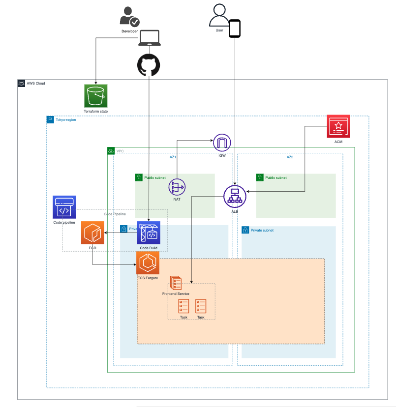

# 概要

Terraform で ECS 開発環境を構築するためのサンプルレポジトリです。


# Step1: aws-cli の設定

profile`default`の部分を環境に応じたコンテクスト名に変更することができます。
これは`./backend/stg/main.tf`に設定する`provider`の`profile`プロパティと一致させます。

## クレデンシャルの設定（初回のみ）

```
$ aws configure --profile default

AWS Access Key ID [None]: <アクセスキー>
AWS Secret Access Key [None]: <シークレットキー>
Default region name [None]: ap-northeast-1
Default output format [None]: json
```

## コンテキストを変更(毎回)

```
$ export AWS_DEFAULT_PROFILE=default

# 確認
$ aws configure list
```

# Step2: tfState 管理用のバケット作成

tfState を管理するための S3 バケット、および同時編集をロックするための DynamoDB テーブルを作成します。
上記 2 つのリソースは異なる環境ごとに作成します。
tfState を S3 バケットでリモート管理し、チーム間での共同開発を行います。

```
$ cd ./backend/stg
$ terraform init
$ terraform plan
$ terraform apply
```

# Step3: 事前準備

## ルートドメイン

Route53 にて、ルートドメインの NS レコードは事前に用意し、下記変数として入力する必要があります。

```
variable "root_domain_name" { type = string }
variable "root_domain_zone_id" { type = string }
```

# Step4: リソース作成

```
$ cd ./env/stg
$ terraform init
$ terraform plan
$ terraform apply
```

# Step5: ECS-Exec をつかってコンテナにアクセスする場合のコマンド

デバッグのため、コンテナを指定して直接ログインすることができます。

```
$ aws ecs execute-command --cluster <cluster-name> \
    --task <task-id> \
    --container <container-name> \
    --interactive \
    --command "/bin/sh"
```
